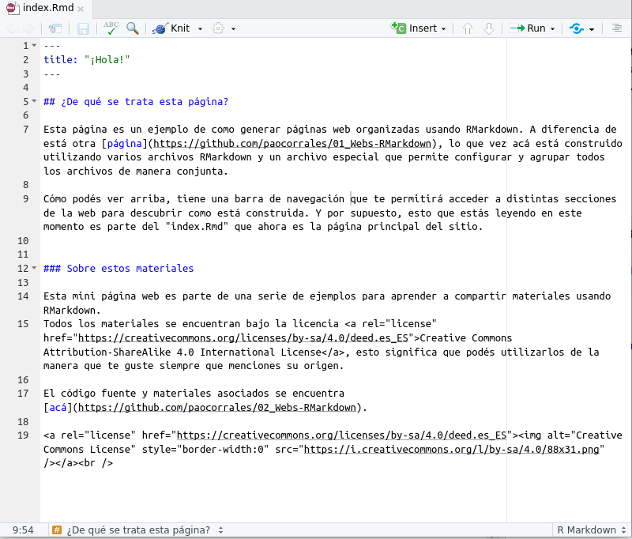

Todo sitio web requiere de un "index.html" y en este caso hace de puerta de entrada de nuestra página web. Se puede generar este archivo a partir de un archivo RMarkdown o simplemente Markdown, la ventaja del primero es que podemos incluir código de R. 

El index de esta mismísima página web tiene esta pinta:

El encabezado no necesita mucha información, en este caso solo aparece **title** y es lo que se mostrará con título de primer orden. El resto es contenido y por supuesto podemos agregar links, videos, imágenes y todo lo que sea necesario.